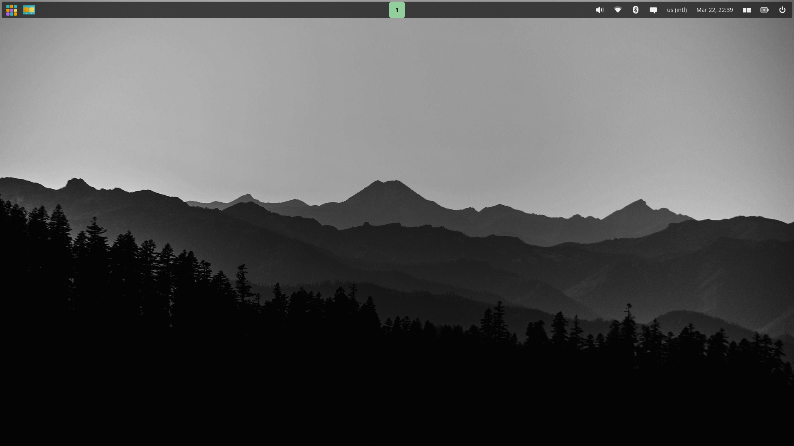
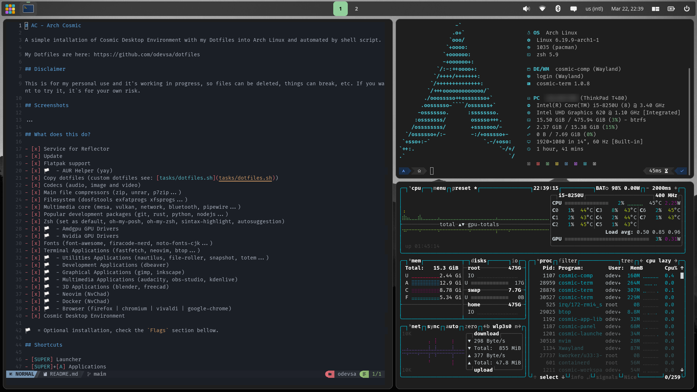

# AC - Arch Cosmic

A simple intallation of Cosmic Desktop Environment with my Dotfiles into Arch Linux and automated by shell script.

My Dotfiles are here: https://github.com/odevsa/dotfiles

## Disclaimer

This is for my personal use and it's working in progress, so files can be deleted, things can break, etc. If you want to try it, it`s for your own risk.

## Screenshots
<table style="border: none; border-collapse: collapse;">
  <tr>
    <td>
      
    </td>
    <td>
      
    </td>
  </tr>
</table>

## What does this do?

- [x] Service for Reflector
- [x] Update
- [x] Flatpak support
- [x] 🏳️ - AUR Helper (yay)
- [x] Copy dotfiles (custom dotfiles see: [tasks/dotfiles.sh](tasks/dotfiles.sh))
- [x] Codecs (audio, image and video)
- [x] Main file compressors (zip, unrar, p7zip...)
- [x] Filesystem (dosfstools exfatprogs xfsprogs...)
- [x] Multimedia core (mesa, vulkan, network, bluetooth, pipewire...)
- [x] Popular development packages (git, rust, python, nodejs...)
- [x] Zsh (set as default, oh-my-posh, oh-my-zsh, sintax-highlight, autosuggestion)
- [x] 🏳️ - Amdgpu GPU Drivers
- [x] 🏳️ - Nvidia GPU Drivers
- [x] Fonts (font-awesome, firacode-nerd, noto-fonts-cjk...)
- [x] Terminal Applications (fastfetch, neovim, btop...)
- [x] 🏳️ - Utilities Applications (nautilus, file-roller, snapshot, totem...)
- [x] 🏳️ - Development Applications (dbeaver)
- [x] 🏳️ - Graphical Applications (gimp, inkscape)
- [x] 🏳️ - Multimedia Applications (audacity, obs-studio, kdenlive)
- [x] 🏳️ - 3D Applications (blender, freecad)
- [x] 🏳️ - Neovim (NvChad)
- [x] 🏳️ - Docker (NvChad)
- [x] 🏳️ - Browser (firefox | chromium | vivaldi | google-chrome)
- [x] Cosmic Desktop Environment

🏳️ = Optional installation, check the `Flags` section bellow.

## Shortcuts

- [SUPER] Launcher
- [SUPER]+[A] Applications
- [SUPER]+[T] Terminal
- [SUPER]+[F] File manager
- [SUPER]+[B] Browser
- [SUPER]+[Q] Close active window
- [SUPER]+[G] Toggle floating
- [SUPER]+[M] Toggle fullscreen
- [SUPER]+[O] Change Orientation
- [SUPER]+[W] View Workspaces
- [SUPER]+[1|2|3|4|5|6|7|8|9|0] Navigate workspace
- [SUPER]+[ESC] Lock screen
- [SUPER]+[ARROW] Change focus window
- [SUPER]+[SHIFT]+[ARROW] Move window

## What you will need

- Any distribution based on Arch Linux, preferably a clean installation of Arch Linux with systemd-boot (grub not tested yet).
- Internet connection:
  - Ethernet
  - Wifi with `iwctl`

    ```
    $ iwctl

    [iwctl]# station <DEVICE> connect "<SSID>"
    ```

  - Wifi with `NetworkManager`
    ```
    $ nmcli device wifi connect "<SSID>" --ask
    ```

## Flags
| Flag                  | Description                                                                                       |
| --------------------- | ------------------------------------------------------------------------------------------------- |
| `--skip-aur-helper`   | Skip YAY and AUR packages installation task.                                                      |
| `--skip-amdgpu`       | Skip AMD GPU (amdgpu) installation task.                                                          |
| `--skip-nvidia`       | Skip NVIDIA GPU (nvidia) installation task.                                                       |
| `--skip-gpu`          | Skip both AMD and NVIDIA GPUs installation task.                                                  |
| `--skip-apps`         | Skip all application-related installation task.                                                   |
| `--skip-neovim`       | Skip Neovim and NvChad installation task.                                                         |
| `--skip-docker`       | Skip Docker installation task.                                                                    |
| `--skip-preferences`  | Skip preferences task.                                                                            |
| `--only-core`         | Installs only core system components, disabling other features like applications and GPU drivers. |

## Automatic Install

Just run this code and see the magic

```
sh -c "$(curl -fsSL https://raw.githubusercontent.com/odevsa/ac/main/run.sh)"
```

You may want to use flags to customize installation for example: If you don't want Nvidia driver and default applications, you can try:

```
sh -c "$(curl -fsSL https://raw.githubusercontent.com/odevsa/ac/main/run.sh)" -- --skip-nvidia --skip-apps
```

## Manual Install

- Install necessary dependencies

  ```
  sudo pacman -S git
  ```

- Clone the repo

  ```
  git clone https://github.com/odevsa/ac.git
  ```

- Enter in folder

  ```
  cd ac
  ```
- If you want to use your own dotfiles repository, change the `REPO_URL` into [tasks/dotfiles.sh](tasks/dotfiles.sh)

- Give permission to execute
  ```
  chmod +x install.sh
  ```

- Run
  ```
  ./install.sh
  ```

- Or run with flags, just add them after the command.
  ```
  ./install.sh --skip-nvidia --skip-apps
  ```

- Input password when it ask for
